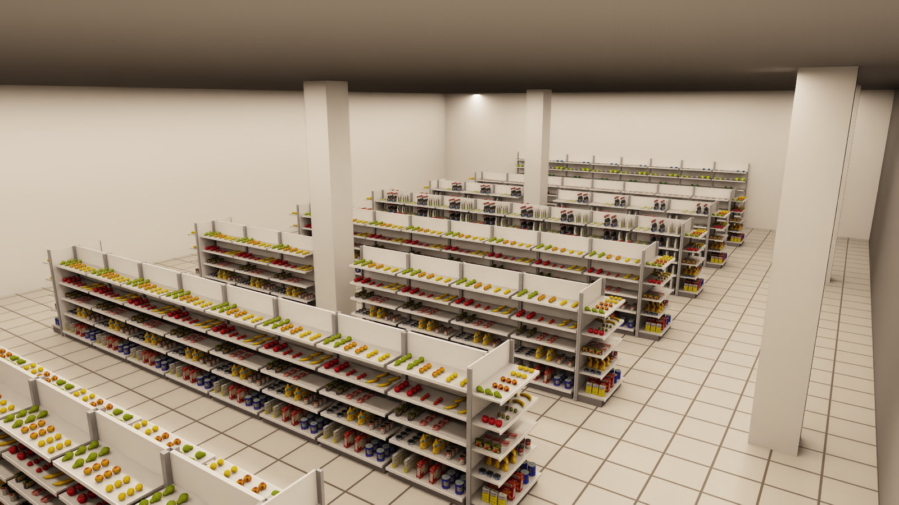
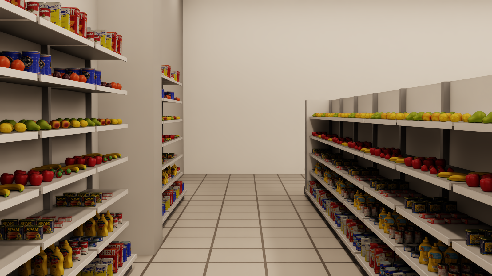
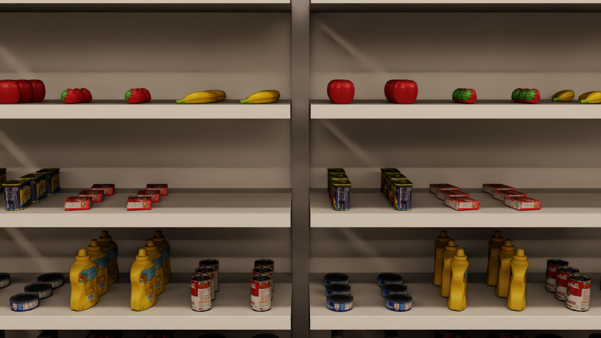
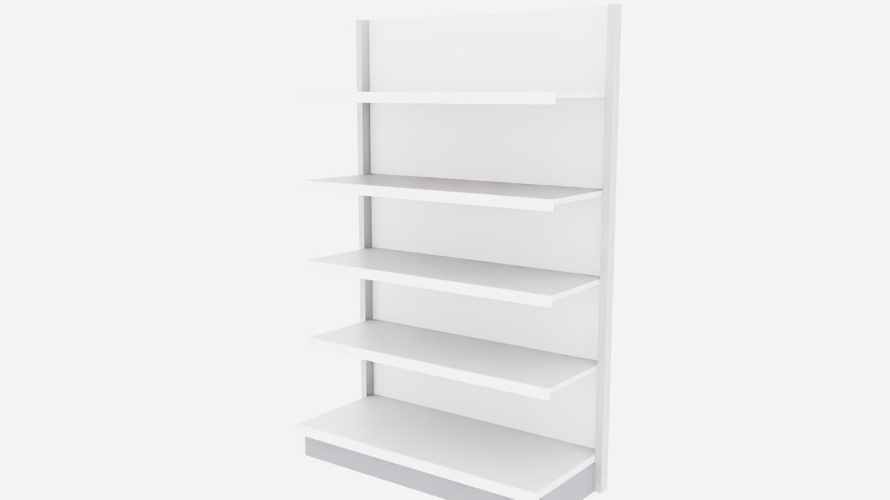
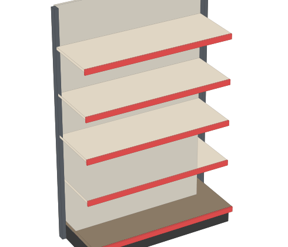
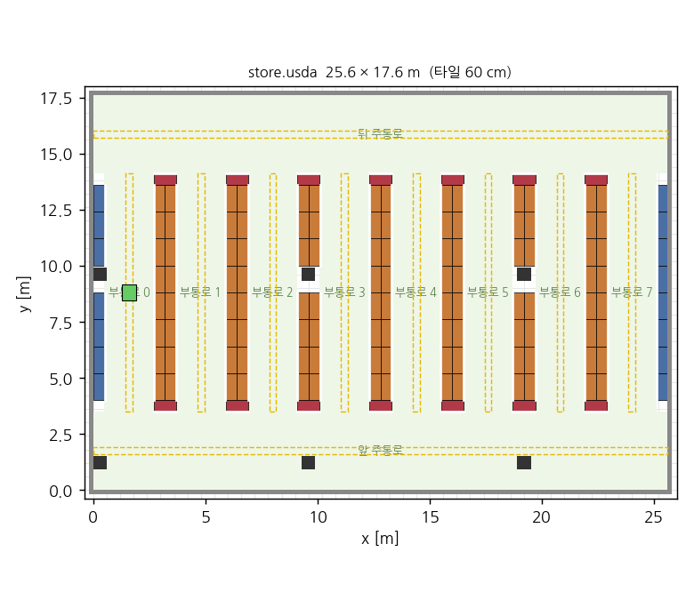
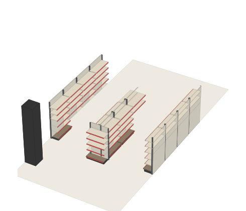

# grocery-picking-sim

**이마트·홈플러스급 대형마트를 디지털 트윈으로 옮기고, 그 안에서 AMR + 로봇팔이 요청받은 상품을 선반에서 집어오게 하는 Isaac Sim 프로젝트.**

`Python → USD → Isaac Sim` · 환경을 손으로 만들지 않고 **치수 상수에서 생성**한다 · 생성 결과는 **되읽어 숫자로 검증**한다

<p align="center">
  
  <br>
  <sub>Isaac Sim RTX 렌더. 파이썬이 생성한 USD 를 그대로 올린 것. 25.6 × 17.6 m, 부통로 8개, 진열대 137대, YCB 스캔 상품 9,864개</sub>
</p>

<p align="center">
  
  
  <br>
  <sub>왼쪽: 부통로 0 안, 사람 눈높이. 왼편이 벽면 진열대(2.4 m), 오른편이 곤돌라(1.8 m). 오른쪽: 곤돌라 정면, 로봇 팔 카메라가 볼 시야. 상품은 실물 스캔(YCB)</sub>
</p>

---

## 목표

- **디지털 트윈** — 대형마트 식품 매장을 Isaac Sim 안에 재현한다. 규모는 매장 전체, 실측은 부통로 1~2개 (곤돌라 규격과 통로 폭은 매장 안에서 반복되므로 한두 통로 값이 전체에 적용된다)
- **상품 피킹** — AMR이 통로를 주행하고, 팔이 선반에서 지정 상품을 찾아 집는다
- **시나리오 생성** — 같은 생성기로 seed 기반 변형(가림·배치·조명)을 만들어 인지·파지 성능을 평가한다
- **검증 가능한 환경** — "잘 만들어진 것 같다"가 아니라, 생성물을 되읽어 치수·통행 가능성을 자동으로 확인한다

## 핵심 아이디어 — 환경은 제작물이 아니라 생성기다

```
scene/constants.py ──┬──→ 디지털 트윈    실측값 고정 배치 (실제 마트 재현)
  (치수 단일 진실)    └──→ 시나리오 생성  seed 기반 랜덤 (가림·기울기·조명 변화)
```

- 치수 상수 하나를 바꾸면 진열대 형상 · 매장 배치 · 상품 슬롯 · 검증 기준이 **전부 따라온다**
- 디지털 트윈은 생성기의 **파라미터가 고정된 한 경우**일 뿐이라, 트윈과 시나리오를 둘 다 얻는 데 추가 비용이 거의 없다
- 실측 전에는 시판 곤돌라 규격과 매장 설계 관행에서 가져온 **잠정값**으로 돌고, 실측 후 값만 교체한다
- 모든 상수에 출처를 표시한다: `[실측]` `[잠정]` `[표준]` `[설계]`

## 설계 원칙

**CAD · Blender를 쓰지 않는다.**
마트 구조물은 직육면체의 조합이다. 파이썬 상수가 CAD 스케치보다 덜 정확할 이유가 없고, `CAD → STEP → 메시 → Blender → USD` 변환 사슬에서 UV·머티리얼이 깨져 어차피 다시 손대게 된다. 파라메트릭 CAD의 가치는 구속조건·공차·어셈블리인데 마트에는 그런 게 없다. 대신 파이썬이 USD를 직접 써내면 **실측값 반영이 즉시 되고, 랜덤화가 같은 코드로 된다.**

**상품은 모델링하지 않는다.**
실물을 스캔한 공개 데이터셋을 슬롯에 배치한다. 실제 매장 SKU를 모델링하는 것은 끝이 없고 인지 성능에도 도움이 안 된다.
- [YCB Object and Model Set](https://registry.opendata.aws/ycb-benchmarks/) — 77종, 물리 속성 포함, 매니퓰레이션 표준 벤치마크
- [Google Scanned Objects](https://research.google/blog/scanned-objects-by-google-research-a-dataset-of-3d-scanned-common-household-items/) — 1,030종, CC-BY 4.0

**생성기는 Isaac Sim 없이 돈다.**
`usd-core`만으로 노트북에서 USD를 만들고 Isaac Sim은 결과를 읽기만 한다. 무거운 시뮬레이터를 띄우지 않고 형상을 반복 수정할 수 있다.

**만든 것은 반드시 되읽어 검증한다.**
생성기와 검증기는 같은 상수를 보지만, 검증기는 생성 코드가 아니라 **USD 파일의 실제 형상(AABB)** 을 읽는다. 회전 방향이나 오프셋 실수는 눈으로 보면 놓치지만 숫자 대조는 놓치지 않는다.

**설계는 양팔, 구현은 한 팔.**
마운트 자리는 처음부터 두 개 잡아두되 한 팔로 먼저 완주한다. 두 번째 팔은 "가림 시나리오의 몇 %가 단일 팔로 안 풀리는지" 측정한 뒤에 붙인다.

## 실제 마트 구조를 어떻게 반영했나

디지털 트윈이 목표라서 "상자 몇 개"가 아니라 **실제 곤돌라 진열대와 매장 구성의 구조**를 그대로 따른다. 치수는 실측 전이라 잠정값이지만, 구조는 실측 후에도 바뀌지 않는다.

### 진열대 (곤돌라 한 면)

<p align="center">
  
  
</p>

```
       ┌─백판─┐
  지주 │      │ 지주       측면이 뚫려 있다 — 팔이 옆에서 진입할 수 있고
       ├──────┤  상단 선반    카메라가 옆 진열대 너머를 본다
       ├──────┤  (얕다)
       ├──────┤
    ┌──┴──────┤  바닥 데크 (깊다) — 위 단 상품이 통로에서 10 cm 안쪽에 있다
    │  걸레받이 │                    → 팔 도달 거리 계산에 직접 들어간다
  ──┴─────────┴──
```

- **뒤쪽 지주 2개 + 백판** — 통판 측판이 아니다. 측면 개방이 파지 계획과 시야에 영향을 준다
- **바닥 데크는 깊고(500), 상단 선반은 얕다(400)** — 데크 아래 걸레받이는 앞면이 들어가 있다
- **가격표 레일** — 각 단 앞에 4 cm 턱. 상품을 앞으로 끌어낼 때 걸리는 지점이라 파지 전략에 관계된다
- **선반 높이는 지주 홀 피치(25 mm) 배수** — 실제 브래킷이 걸리는 위치로 스냅된다
- **단마다 여유 높이가 다르다** — 최상단은 위에 판이 없다. 하나의 값으로 퉁치면 안 들어가는 상품을 배치하게 된다
- 슬롯마다 "들어갈 수 있는 상품 최대 치수"를 같이 들고 있어 배치 단계에서 안 맞는 에셋을 거른다

### 상품 (YCB 실물 스캔)

- **모델링하지 않고 스캔 데이터셋을 쓴다.** YCB 구글 스캔 메시 85개를 받아 USD 로 바꾸고, 그중 마트에서 팔 만한 32종(캔·박스·병·과일·생활용품·주방·문구·완구·스포츠)만 쓴다
- 에셋마다 **치수는 메시에서, 질량은 YCB 논문 표에서** 가져와 강체·볼록껍질 콜라이더와 함께 붙인다. 선반 위에 놓으면 그대로 물리가 돈다
- **진열 관행대로 채운다.** 통로마다 품목군(플래노그램), 같은 상품을 옆으로 이어 붙이고(페이싱), 앞뒤로 여러 개 세운다
- **트윈과 시나리오가 같은 코드다.** seed 없이 돌리면 결정적 배치, seed 를 주면 상품 순서·빈 자리가 흔들린다
- 인스턴싱으로 같은 상품 수천 개가 메시 하나를 공유한다. 9,864개를 올려도 렌더가 2~3분

### 매장 (대형마트 식품 매장 한 층의 일부)

<p align="center">
  
  
  <br>
  <sub>USD 형상에서 뽑은 평면도. 파랑=벽면 진열대, 주황=양면 곤돌라, 빨강=엔드캡, 검정=기둥, 점선=조명, 초록=AMR (0.6 × 0.7 m). 기둥이 떨어진 자리는 진열대를 비운다</sub>
</p>

| | 잠정값 | 근거 |
|---|---|---|
| 부통로 | 8개 × 2.2 m | 대형마트 부통로 2.0~2.4 m, 카트 두 대 교행 |
| 주통로 | 앞·뒤 3.5 m | 대형마트 주통로 3.0~4.0 m |
| 곤돌라 열 | 8대 × 1.2 m = 9.6 m | 열 길이 10 m 내외 |
| 천장 | 5.0 m | 노출 천장 4.5~6 m |
| 기둥 | 0.6 m 각, 9.6 × 8.4 m 그리드 | 곤돌라 열 간격의 배수로 두어 열 위에 오게 (설계 관행) |
| 바닥 | 25.6 × 17.6 m = 451 m² | 부통로 8개가 만드는 크기 |

- **주통로 / 부통로** — 주통로는 넓고(AMR 회전 구간), 부통로는 진열대 사이
- **양면 곤돌라** — 등을 맞댄 두 면. 부통로 사이에 선다
- **엔드캡** — 곤돌라 열 양 끝, 주통로를 보는 단면 진열대 (행사 상품 자리)
- **벽면 진열대** — 벽에 붙고 곤돌라보다 높다 (2.4 m)
- **기둥** — 건물 구조 그리드. 열 위에 오면 그 자리 진열대를 비우고, 통로에 걸치면 통행 검사에 잡힌다
- **천장 + 통로별 라인 조명** — 시나리오 생성기가 세기·색온도를 흔들 축
- **60 cm 타일 바닥** — 실측할 때 타일이 자(尺)가 된다 (`docs/SURVEY.md`). 화면에서도 셀 수 있게 텍스처로 깐다
- 매장 좌표 원점은 **바닥 모서리** — 실측 때 벽 모서리에서 재는 것과 같다
- 프림 이름이 곧 작업 지시 단위: `/World/Shelves/Aisle_00/L/Unit_02` = 부통로 0 왼쪽 면 세 번째 진열대

## 검증

생성할 때마다 자동으로 147항목을 대조한다. 실패하면 종료 코드 1이라 CI에 바로 걸 수 있다.

| 검증기 | 항목 수 | 보는 것 |
|---|---|---|
| `tools/verify_shelf.py` | 58 | 외형 치수, 지주 위치·측면 개방, 단별 높이·두께·앞단 위치, 레일, 홀 피치 스냅, 콜라이더, 슬롯 내부 여부, 대표 상품(캔·크래커·병) 적합성 |
| `tools/verify_store.py` | 82 | 바닥·천장·벽·기둥·조명, 진열대 대수·높이·바닥 접촉·벽 내부, 상호 겹침(137대 쌍 검사), 기둥 간섭, 앞면이 통로 경계에 있는지, **AMR 직진 여유폭 · 제자리 회전 · 통로 입구 회전 가능성** (통로 10개 × 입구 16곳) |
| `tools/verify_stock.py` | 7 | 상품 9,864개 전부: 참조가 풀려 메시가 있는지, 강체·콜라이더·질량, 밑면이 선반에 닿는지(±2 mm), 자기 슬롯 안(폭·깊이·높이)인지, 같은 진열대 안 겹침, 메타데이터 중복 |

통행 검사는 상수가 아니라 USD 안의 실제 형상으로 한다. 기둥·엔드캡·가격표 레일이 통로로 튀어나온 만큼을 전부 반영한 뒤, AMR 본체 + 안전 여유가 들어가는지 본다.

## 현재 상태

| | | |
|---|---|---|
| `scene/constants.py` | ✅ | 치수 단일 진실 공급원. 출처 태그 부착, 대부분 `[잠정]` |
| `scene/shelf.py` | ✅ | 곤돌라 진열대 생성기 (지주·백판·데크·걸레받이·선반·레일, 슬롯 좌표) |
| `scene/store.py` | ✅ | 매장 생성기 (대형마트 규모, 주·부통로, 벽면·양면·엔드캡, 기둥 그리드, 조명, 타일 바닥) |
| `tools/verify_shelf.py` | ✅ | 진열대 대조 검증 58항목 |
| `tools/verify_store.py` | ✅ | 매장 대조 검증 + AMR 통행 82항목 |
| `tools/plan_store.py` | ✅ | USD → 평면도 PNG |
| `tools/render_3d.py` | ✅ | USD → 3D PNG / 회전 GIF (matplotlib, 형상 확인용) |
| `tools/render_isaac.py` | ✅ | USD → Isaac Sim RTX 렌더 (헤드리스) |
| `tools/ycb_catalog.py` | ✅ | YCB 스캔 메시 → USD 에셋(텍스처·강체·질량) + 치수 카탈로그 84종 |
| `scene/stock.py` | ✅ | 상품 배치: 플래노그램·페이싱·앞뒤 세우기, seed 시나리오, 인스턴싱 |
| `tools/verify_stock.py` | ✅ | 상품 배치 검증 |
| 실측 | ⬜ | `docs/SURVEY.md` 절차대로 통로 1~2개 |
| `scene/scenario.py` | ⬜ | seed 기반 시나리오 생성 |
| 로봇 | ⬜ | AMR + 단일 팔, Isaac Sim 주행·검출·파지 |

## 쓰는 법

```bash
python3 -m venv .venv && .venv/bin/pip install usd-core matplotlib   # matplotlib 은 평면도용

.venv/bin/python -m scene.shelf --out out/shelf.usda          # 진열대 생성
.venv/bin/python -m tools.verify_shelf out/shelf.usda         # 58항목 검증

.venv/bin/python -m scene.store --out out/store.usda          # 매장 생성 (+ floor_tile.png)
.venv/bin/python -m tools.verify_store out/store.usda         # 82항목 검증
.venv/bin/python -m tools.plan_store out/store.usda           # 평면도 → out/store_plan.png
.venv/bin/python -m tools.render_3d  out/store.usda --gif out/store_3d.gif   # 3D 회전 GIF

# 상품: YCB 스캔 메시 받기 (600 MB) → USD 에셋 + 카탈로그 → 슬롯에 채우기 → 검증
aws s3 sync --no-sign-request --exclude "*" --include "*_google_16k.tgz" s3://ycb-benchmarks/data/google/ assets/ycb/raw/
.venv/bin/python -m tools.ycb_catalog
.venv/bin/python -m scene.stock --store out/store.usda --out out/store_stocked.usda   # 트윈 (결정적)
.venv/bin/python -m scene.stock --seed 7 --fill 0.7 --out out/scenario_007.usda      # 시나리오
.venv/bin/python -m tools.verify_stock out/store_stocked.usda
```

Isaac Sim은 `out/store.usda`를 스테이지에 얹기만 하면 된다. 실제 렌더는 Isaac Sim 파이썬으로:

```bash
source ~/.isaac_cache_env   # OMNI_KIT_ACCEPT_EULA=YES 등
~/isaac6-venv/bin/python -m tools.render_isaac out/store.usda --out out/isaac
```

## 로드맵

1. **실측** — 마트 한 곳에서 부통로 1~2개. 타일·상품을 자로 쓰는 절차는 `docs/SURVEY.md`
2. **상품 확장** — YCB 는 마트 상품이 32종뿐이라 통로가 단조롭다. Google Scanned Objects 로 넓힌다
3. **`scenario.py`** — 가림·기울어짐·조명 변화를 seed 하나로 재현 (stock 의 seed 모드 위에)
4. **Isaac Sim** — AMR 주행 → 상품 검출 → 파지 → 회수
5. **μ 스윕** — 선반·그리퍼 마찰계수는 실측 불가능한 값이라 하나로 고정하지 않고 스윕 축으로 둔다

## 레포 구조

```
scene/
  constants.py    치수 단일 진실 공급원 — 여기서 시작한다
  shelf.py        진열대 생성기 + 슬롯 좌표
  store.py        매장 생성기 + 배치·통로 계산
  stock.py        상품 배치 (플래노그램 · seed 시나리오)
tools/
  ycb_catalog.py  YCB 메시 → USD 에셋 + 카탈로그
  verify_stock.py 상품 배치 검증
  verify_shelf.py 진열대 검증
  verify_store.py 매장 검증 + AMR 통행
  plan_store.py   평면도 렌더
  render_3d.py    3D PNG / GIF 렌더 (matplotlib)
  render_isaac.py Isaac Sim RTX 렌더
assets/ycb/
  catalog.json    상품 치수·질량·분류 (커밋). 메시·USD 는 받아서 만든다 (gitignore)
docs/
  SURVEY.md       실측 안내 — 무엇을, 어떻게, 얼마나만 잴 것인가
  LOG.md          개발 기록 — 무엇을 왜 했는지, 날짜순
  img/            README 그림 (전부 도구로 재생성 가능)
```

## 개발 기록

결정과 이유는 [`docs/LOG.md`](docs/LOG.md) 에 날짜순으로 남긴다. "이 숫자 어디서 났냐", "왜 이렇게 했냐"에 답하는 곳이다.

## 기술 스택

- **USD** (`usd-core`) — 장면 기술. Isaac Sim 네이티브 포맷
- **NVIDIA Isaac Sim** — 물리·렌더·로봇 (EC2 GPU 인스턴스)
- **Python 3.10+** — 생성기·검증기. 의존성은 `usd-core` 하나 (평면도만 `matplotlib`)

## 참고

- [arXiv:2409.15465](https://arxiv.org/abs/2409.15465) — 선반 로컬 프레임(+X 안쪽, yz 평면 = 통로에서 본 실루엣)의 축 규약을 이 논문의 item frame 과 맞췄다
- [YCB Object and Model Set](https://registry.opendata.aws/ycb-benchmarks/), [Google Scanned Objects](https://research.google/blog/scanned-objects-by-google-research-a-dataset-of-3d-scanned-common-household-items/) — 상품 에셋
